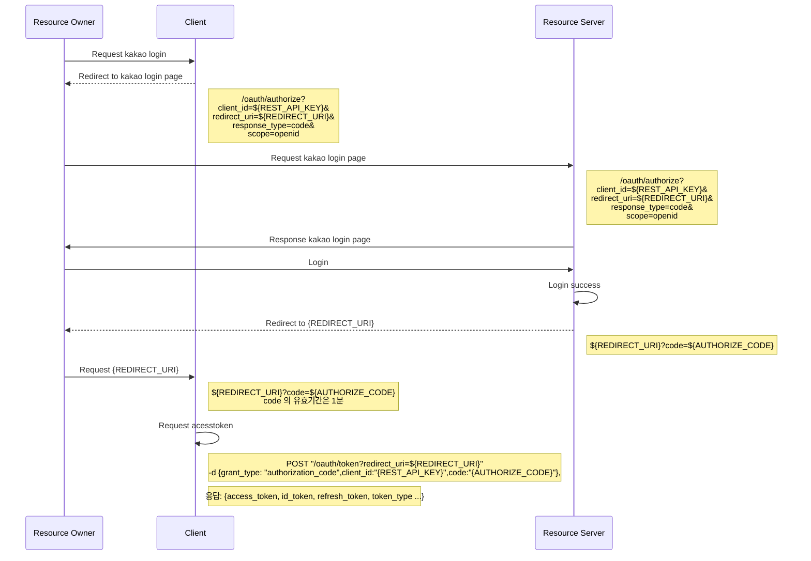

# oauth2-proxy-ko
## Settings
### Environment variables
| Option         | Type   | Description |
|----------------|--------|------------|
| --client-id    | string | KAKAO      |
| --redirect-uri | string | localhost  |
### Run
```shell

```

## IDP 
### Kakao
- Base url: https://kauth.kakao.com
- Required: REST_API_KEY, REDIRECT_URI, OIDC 여부, 

#### Without oauth2-proxy-ko


#### With oauth2-proxy-ko 
### Naver

## Ref
- https://github.com/oauth2-proxy/oauth2-proxy