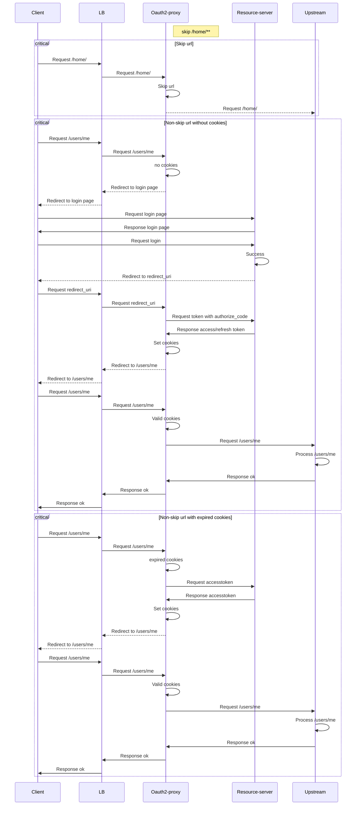
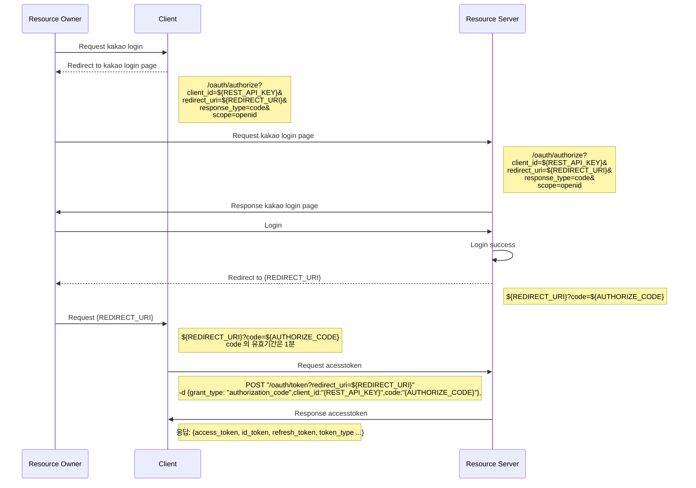

# oauth2-proxy-ko
## Settings
### Environment variables
| Option         | Type   | Example               |
|----------------|--------|-----------------------|
| --client-id    | string |  |
| --redirect-uri | string |  |
### Run
```shell

```
## Docs
### Flow


### IDP 
#### Kakao
- Base url: https://kauth.kakao.com
- Required: REST_API_KEY, REDIRECT_URI, OIDC 여부, 



#### Naver
### Todo...
- httponly, secure cookies
  - 개발자 도구로 열어서 토큰을 탈취하는건?
- 서명 -> 무결성 보장
  - 민감정보 -> 암호화 후 서명
  - https://www.npmjs.com/package/fastify-secure-session/v/2.2.1
  - AES, HMAC SHA256
- upstream forwarding -> proxy server?
  - https://github.com/fastify/fastify-http-proxy
  - https://www.npmjs.com/package/http-proxy-middleware

## Ref
- https://github.com/oauth2-proxy/oauth2-proxy